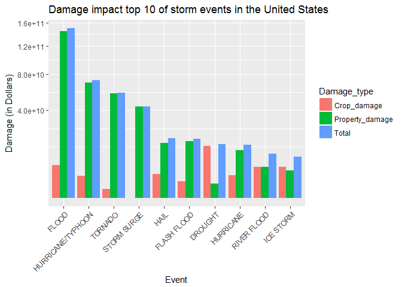

# Impact Assessment of Storm Events in the United States
Jorik Schra  
5th of June 2017  

## Summary
Storms and other severe weather events can cause both public health and economic problems for communities and municipalities. This report documents the results of an analysis of data of the U.S. National Oceanic and Atmospheric Administration's (NOAA) storm database. 

The analysis focuses on the most damaging storm events in the United States in terms of population health and damage to property and crops. For these impacts, the top 10 storm events are assessed, which might be interesting for those who are responsible for preparing for severe weather events, especially when it is required to prioritize resources for different types of events.

## Introduction

As previously stated, storms and other severe weather events can have a significant impact on both public health and economic problems for communities and municipalities. Many severe events can result in fatalities, injuries, and property damage, and preventing such outcomes to the extent possible is a key concern.

This project involves exploring the U.S. National Oceanic and Atmospheric Administration's (NOAA) storm database. This database tracks characteristics of major storms and weather events in the United States, including when and where they occur, as well as estimates of any fatalities, injuries, and property damage.

The report documents both the results and the code used to perform the analysis, in order to ensure reproducibility.

## Used Packages and the Data

The analysis of this report was performed in R-studio (ver. 3.3.3). For the analysis, the following packages are used.


```r
library(dplyr)
library(tidyr)
library(ggplot2)
```

After loading the packages above, the data must be downloaded. Make sure you choose the working directory where you want the data to be downloaded, as the code automatically does so.


```r
# Set working directory
setwd("D:/R Directories/Coursera/Reproducible Research/Course Project 2")

# Download (if necessary) and read in the data

if (!file.exists("Stormdata.csv.bz2")) {
      fileUrl <- "https://d396qusza40orc.cloudfront.net/repdata%2Fdata%2FStormData.csv.bz2"
      download.file(fileUrl, "Stormdata.csv.bz2")
      df <- read.csv("Stormdata.csv.bz2")
      invisible(rm(fileUrl))
} else {
      df <- read.csv("Stormdata.csv.bz2") 
}
```


## Data Processing

In order to proceed to the analysis, one must first obtain a sense of how the data looks. The first step is to check the dimensions and columnnames of the data.


```r
dim(df)
```

```
## [1] 902297     37
```

```r
names(df)
```

```
##  [1] "STATE__"    "BGN_DATE"   "BGN_TIME"   "TIME_ZONE"  "COUNTY"    
##  [6] "COUNTYNAME" "STATE"      "EVTYPE"     "BGN_RANGE"  "BGN_AZI"   
## [11] "BGN_LOCATI" "END_DATE"   "END_TIME"   "COUNTY_END" "COUNTYENDN"
## [16] "END_RANGE"  "END_AZI"    "END_LOCATI" "LENGTH"     "WIDTH"     
## [21] "F"          "MAG"        "FATALITIES" "INJURIES"   "PROPDMG"   
## [26] "PROPDMGEXP" "CROPDMG"    "CROPDMGEXP" "WFO"        "STATEOFFIC"
## [31] "ZONENAMES"  "LATITUDE"   "LONGITUDE"  "LATITUDE_E" "LONGITUDE_"
## [36] "REMARKS"    "REFNUM"
```

Accordingly, the data comprises of 37 variables of 902297 records concerning storm events. From the call to the names function, a selection of these 37 columns can be made which are relevant for the analysis of this report. Hence, the following data frame is constructed to only include data on events, impacts on health and impacts to properties and crops.


```r
dfs <- select(df, EVTYPE, FATALITIES, INJURIES, PROPDMG, PROPDMGEXP, CROPDMG, 
              CROPDMGEXP)
```

Having selected the relevant subset for the analysis, the next step is to further zoom in on what the data looks like and its completeness. This can be done as follows:


```r
# Check the data
str(dfs)
```

```
## 'data.frame':	902297 obs. of  7 variables:
##  $ EVTYPE    : Factor w/ 985 levels "   HIGH SURF ADVISORY",..: 834 834 834 834 834 834 834 834 834 834 ...
##  $ FATALITIES: num  0 0 0 0 0 0 0 0 1 0 ...
##  $ INJURIES  : num  15 0 2 2 2 6 1 0 14 0 ...
##  $ PROPDMG   : num  25 2.5 25 2.5 2.5 2.5 2.5 2.5 25 25 ...
##  $ PROPDMGEXP: Factor w/ 19 levels "","-","?","+",..: 17 17 17 17 17 17 17 17 17 17 ...
##  $ CROPDMG   : num  0 0 0 0 0 0 0 0 0 0 ...
##  $ CROPDMGEXP: Factor w/ 9 levels "","?","0","2",..: 1 1 1 1 1 1 1 1 1 1 ...
```

```r
# Check for missing values
mv <- colMeans(!is.na(dfs), na.rm=FALSE)
mv <- data.frame(Variables = names(mv), Percentage_filled=mv)
mv <- mv[order(mv$Percentage_filled, decreasing = TRUE), ]
row.names(mv) <- 1:length(mv$Variables)
mv
```

```
##    Variables Percentage_filled
## 1     EVTYPE                 1
## 2 FATALITIES                 1
## 3   INJURIES                 1
## 4    PROPDMG                 1
## 5 PROPDMGEXP                 1
## 6    CROPDMG                 1
## 7 CROPDMGEXP                 1
```

As can be seen in the output from the call to `str()`, the data comprises of 4 numeric variables and 3 factor variables. None of the variables include missing values, as indicated by the output of the second chunck of code. The percentage_filled column indicates that all columns are filled 100%.

Nonetheless, one should proceed cautiously with factor variables. Hence, these are further assessed before proceeding to data manipulations.


```r
head(unique(dfs$EVTYPE), 25)
```

```
##  [1] TORNADO                      TSTM WIND                   
##  [3] HAIL                         FREEZING RAIN               
##  [5] SNOW                         ICE STORM/FLASH FLOOD       
##  [7] SNOW/ICE                     WINTER STORM                
##  [9] HURRICANE OPAL/HIGH WINDS    THUNDERSTORM WINDS          
## [11] RECORD COLD                  HURRICANE ERIN              
## [13] HURRICANE OPAL               HEAVY RAIN                  
## [15] LIGHTNING                    THUNDERSTORM WIND           
## [17] DENSE FOG                    RIP CURRENT                 
## [19] THUNDERSTORM WINS            FLASH FLOOD                 
## [21] FLASH FLOODING               HIGH WINDS                  
## [23] FUNNEL CLOUD                 TORNADO F0                  
## [25] THUNDERSTORM WINDS LIGHTNING
## 985 Levels:    HIGH SURF ADVISORY  COASTAL FLOOD ... WND
```

```r
head(unique(dfs$PROPDMGEXP), 25)
```

```
##  [1] K M   B m + 0 5 6 ? 4 2 3 h 7 H - 1 8
## Levels:  - ? + 0 1 2 3 4 5 6 7 8 B h H K m M
```

```r
head(unique(dfs$CROPDMGEXP), 25)
```

```
## [1]   M K m B ? 0 k 2
## Levels:  ? 0 2 B k K m M
```

The EVTYPE variable indicates the type of event for which the data has been recorded and does not seem to include strange values based on this quick analysis. The other two variables, however, do include some levels which are questionable. For `PROPDMGEXP`, the questionable levels are -, ? and +, whereas `CROPDMGEXP` only includes `?`. All other levels indicate magnitudes of damage, where `2` indicates `10^2`, while `m` or `M` indicates `10^6`. 

To see if this poses a problem, it is interesting to see how many times these questionable levels (and the others) are used in the data.


```r
table(dfs$PROPDMGEXP)
```

```
## 
##             -      ?      +      0      1      2      3      4      5 
## 465934      1      8      5    216     25     13      4      4     28 
##      6      7      8      B      h      H      K      m      M 
##      4      5      1     40      1      6 424665      7  11330
```

```r
table(dfs$CROPDMGEXP)
```

```
## 
##             ?      0      2      B      k      K      m      M 
## 618413      7     19      1      9     21 281832      1   1994
```

Luckily, the strange levels are only sparsely used. Accordingly, these shall be recoded to 0. As for the other levels, these shall be recoded to magnitudes in the form of `10^X`, whereas empty elements will be recoded to 0. The code to do so is as follows:


```r
# Change property damage elements to magnitudes
dfs$PROPDMGEXP <- as.character(dfs$PROPDMGEXP)

dfs$PROPDMGEXP[dfs$PROPDMGEXP == "1"] <- 10^1
dfs$PROPDMGEXP[dfs$PROPDMGEXP == "2"] <- 10^2
dfs$PROPDMGEXP[dfs$PROPDMGEXP == "3"] <- 10^3
dfs$PROPDMGEXP[dfs$PROPDMGEXP == "4"] <- 10^4
dfs$PROPDMGEXP[dfs$PROPDMGEXP == "5"] <- 10^5
dfs$PROPDMGEXP[dfs$PROPDMGEXP == "6"] <- 10^6
dfs$PROPDMGEXP[dfs$PROPDMGEXP == "7"] <- 10^7
dfs$PROPDMGEXP[dfs$PROPDMGEXP == "8"] <- 10^8
dfs$PROPDMGEXP[dfs$PROPDMGEXP == "B"] <- 10^9
dfs$PROPDMGEXP[dfs$PROPDMGEXP %in% c("h", "H")] <- 10^2
dfs$PROPDMGEXP[dfs$PROPDMGEXP == "K"] <- 10^3
dfs$PROPDMGEXP[dfs$PROPDMGEXP %in% c("m", "M")] <- 10^6

dfs$PROPDMGEXP[dfs$PROPDMGEXP == "0"] <- 10^0
dfs$PROPDMGEXP[dfs$PROPDMGEXP == ""] <- 1
dfs$PROPDMGEXP[dfs$PROPDMGEXP == "+"] <- 0
dfs$PROPDMGEXP[dfs$PROPDMGEXP == "?"] <- 0
dfs$PROPDMGEXP[dfs$PROPDMGEXP == "-"] <- 0

dfs$PROPDMGEXP <- as.numeric(dfs$PROPDMGEXP)

# Change crop damage elements to magnitudes
dfs$CROPDMGEXP <- as.character(dfs$CROPDMGEXP)

dfs$CROPDMGEXP[dfs$CROPDMGEXP=="2"] <- 10^2
dfs$CROPDMGEXP[dfs$CROPDMGEXP=="B"] <- 10^9
dfs$CROPDMGEXP[dfs$CROPDMGEXP %in% c("k", "K")] <- 10^3
dfs$CROPDMGEXP[dfs$CROPDMGEXP %in% c("m", "M")] <- 10^6

dfs$CROPDMGEXP[dfs$CROPDMGEXP=="0"] <- 10^0
dfs$CROPDMGEXP[dfs$CROPDMGEXP=="?"] <- 0
dfs$CROPDMGEXP[dfs$CROPDMGEXP==""] <- 0

dfs$CROPDMGEXP <- as.numeric(dfs$CROPDMGEXP)
```

To check if the data has been succesfully recoded, the following code can be run:


```r
table(dfs$PROPDMGEXP)
```

```
## 
##      0      1     10    100   1000  10000  1e+05  1e+06  1e+07  1e+08 
##     14 466150     25     20 424669      4     28  11341      5      1 
##  1e+09 
##     40
```

```r
table(dfs$CROPDMGEXP)
```

```
## 
##      0      1    100   1000  1e+06  1e+09 
## 618420     19      1 281853   1995      9
```

Lastly, the `PROPDMG` and `PROPDMGEXP` can be used to generate a new variable which contains the amount of damage in Dollars. Similarly, this can be done for the data on crop damage.


```r
dfs %>%
      mutate(Property_damage = PROPDMG*PROPDMGEXP) %>%
      mutate(Crop_damage = CROPDMG*CROPDMGEXP) -> dfs
```

The data can now be used for the analysis.

## Results

The first question regarding the data is as follows:

*Across the United States, which types of events (as indicated in the EVTYPE variable) are most harmful with respect to population health?*

To address this question, the `EVTYPE`, `INJURIES` and `FATALITIES` columns are used.
Subsequently, the data is grouped on `EVTYPE` to calculate the sum of injuries and
fatalities per event type. In addition, a new variable is created, `Total`, which sums
the amount of injuries and fatalities, which can then be used to create a top 10. Lastly, the data is melted to a long form for subsequent use in ggplot2.


```r
dfs_g <- select(dfs, EVTYPE, INJURIES, FATALITIES)

dfs_g %>% 
      mutate(TOTAL = INJURIES+FATALITIES) %>%
      group_by(EVTYPE) %>%
      summarise(Injuries = sum(INJURIES), Fatalities = sum(FATALITIES),
                Total = sum(TOTAL)) %>%
      arrange(desc(Total)) %>%
      slice(1:10) %>%
      gather(Population_harm, amount, -EVTYPE) -> dfs_g
```

Using the `dfs_g` data frame, a bar plot is construed to show which type of storm events
have the highest impact on population health. This can be done as follows:


```r
g <- ggplot(dfs_g, aes(x=reorder(EVTYPE, -amount), y=amount, group=Population_harm))

g +
      geom_bar(stat="identity", aes(fill=Population_harm), position="dodge") +
      scale_y_sqrt() +
      labs(x="Event", y="Frequency count", title="Population health impact top 10 of storm events in the United States") +
      theme(axis.text.x = element_text(angle=45, hjust=1))
```

<!-- -->

As is apparent from the resulting plot, tornadoes are the primary cause of fatalities
and injuries in the United States. Next, events such as excessive heat, thunderstorm wind and floods are the most damaging, although these are closer in terms of damage and significantly less damaging than tornadoes.

The second question regarding the data is as follows:

*Across the United States, which types of events have the greatest economic consequences?*

In order to address this question, the `EVTYPE` column is used again, but this time in combination with `Property_damage` and `Crop_damage`, which were constructed at the end of the data processing section.

Similarly to the first question, the following code is used to aggregate the data on event type level and choose the most damaging events by summing the damage types (property and crop). The last line is again used to melt the data to a long form for subsequent use in ggplot2. 


```r
dfs_g <- select(dfs, EVTYPE, Property_damage, Crop_damage)

dfs_g %>% 
      mutate(Total = Property_damage + Crop_damage) %>%
      group_by(EVTYPE) %>%
      summarise(Property_damage = sum(Property_damage), Crop_damage = sum(Crop_damage),
                Total = sum(Total)) %>%
      arrange(desc(Total)) %>%
      slice(1:10) %>%
      gather(Damage_type, Amount, -EVTYPE) -> dfs_g
```

Using the `dfs_g` data frame, a bar plot is construed to show which type of storm events
cause the most property and crop damage. This can be done as follows:


```r
# plot
g <- ggplot(dfs_g, aes(x=reorder(EVTYPE, -Amount), y=Amount, group=Damage_type))

g +
      geom_bar(stat="identity", aes(fill=Damage_type), position="dodge") +
      scale_y_sqrt() +
      labs(x="Event", y="Damage (in Dollars)", title="Damage impact top 10 of storm events in the United States") +
      theme(axis.text.x = element_text(angle=45, hjust=1))
```

<!-- -->

As can be seen from the plot, the most damaging storm events are floods, followed up by hurricanes/typhoons and tornadoes. It is interesting to note that drought is (by far) the most damaging event in terms of crop damage, yet only ranks 7th in the top 10 overall.
